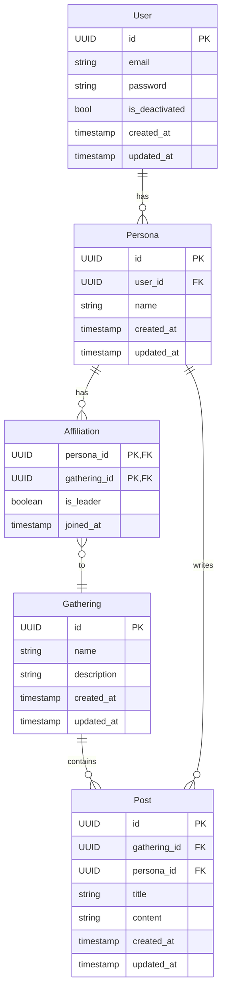

# HobbyRoom

HobbyRoom은 사용자들이 취미 기반의 모임을 만들고 참여할 수 있는 백엔드 API 프로젝트입니다.

## ✨ 기술 스택

*   **언어:** Python 3.13
*   **웹프레임워크:** FastAPI
*   **데이터베이스:** PostgreSQL
*   **ORM:** SQLAlchemy
*   **데이터검증:** Pydantic 
*   **웹 서버:** Nginx

## 📂 프로젝트 구조

이 프로젝트는 도메인 주도 설계(DDD)의 일부 개념을 차용하여 각 도메인(`auth`, `user`, `gathering`)이 독립적인 구조를 가지도록 설계되었습니다.

```
hobbyroom/
├── app/            # FastAPI 애플리케이션 설정 및 진입점
├── auth/           # 인증 및 권한 부여 도메인
├── user/           # 사용자 및 페르소나 도메인
├── gathering/      # 모임 및 소속 도메인
├── database/       # 데이터베이스 연결, 모델, UoW 등 공통 로직
├── container.py    # 의존성 주입(DI) 컨테이너 설정
└── settings.py     # 프로젝트 설정
```

## 🗄️ 데이터베이스 구조

이 프로젝트는 SQLAlchemy와 Alembic을 사용하여 데이터베이스 스키마를 관리합니다. 주요 테이블과 관계는 다음과 같습니다.

### 주요 테이블 및 관계

*   **Users**: 시스템의 기본 사용자 계정 정보.
*   **Personas**: 사용자가 생성하는 모임 소속 프로필. 한 명의 사용자는 여러 페르소나를 가질 수 있습니다.
*   **Gatherings**: 취미 모임 정보.
*   **Affiliations**: 페르소나와 모임 간의 소속 관계를 나타내는 테이블 (Many-to-Many).
*   **Posts**: 모임 내에서 작성된 게시글.



## 🚀 시작하기

### 사전 요구사항

*   Docker
*   Docker Compose
*   Make

### 로컬 설치 및 실행

현재 로컬 빌드 및 실행까지만 구현되어 있습니다.
아래 명령어를 실행하여 `http://localhost:8000`(또는 `nginx.conf`에 설정된 포트)에서 API 서버가 실행됩니다.

```sh
make local
```
